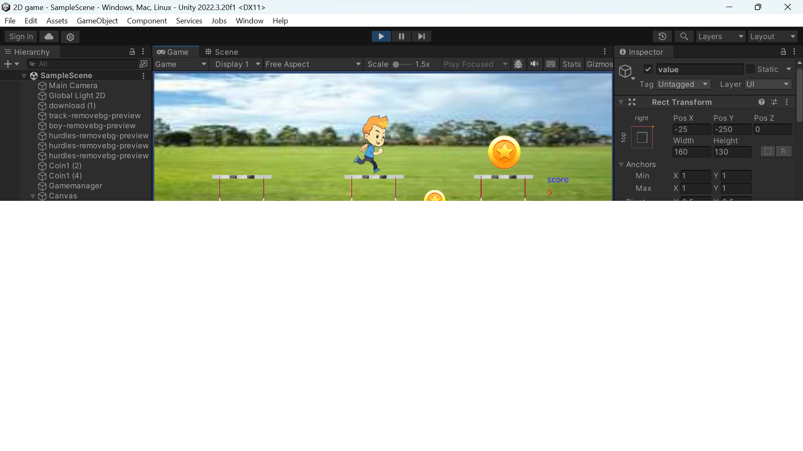

# PingPongGame
## Aim
To create a 2D Ping Pong game using Unity Engine.

## Algorithm
### Step 1
Create a new scene and save. Then right click hierarchy and click ->create empty (name as Game manager).

### Step 2
In the Asserts create new C# script and (name as GameManager) two more scripts (named as Ball and Paddle).

### Step 3
Right click creat-> 2D->spirates-> circle then create->2D->spirates->square. Drag these from asserts to hierarchy and change the position and scale in the inspector.

### Step 4
For both the sprites->Add Components-> BoxCollider 2D (Tick in IsTigger) and Rigidbody 2D(Change the body type to Kinematics )

### Step 5
For both the sprites -> Add the tag. In inspector-> Tag-> Click AddTag and create the tag with name as(Paddle) and make the tag as Paddle so we can whether ball is hitting paddle or somewhere else in script. Similarly do for Ball.

### Step 6
Drag the ball and paddle from hierarchy to the Asserts-> Sprites to create prefabs and reset the position of Paddle to (0,0,0) and delete ball and paddle from hierarchy.

### Step 7
Click the Game manager in hierarchy and drag the GameManager script to Inspector and open the script Public Ball ball; Public Paddle paddle; Check in the unity whether the variables are displaying in the unity.

### Step 8
Now Click the ball game object which we deleted from hierarchy and incorporate the ball script to it, similarly,click paddle game object and incorporate the paddle script to it. Then drag the paddle variable and ball variable into game manager. Type the code th GameManager and Paddle.

### Step 9
Edit-> Project settings-> Input -> Axes (2) -> Horizontal (name as PaddleLeft) and Vertical (name as PaddleRight).

### Step 10
In PaddleRight (Negative button - down and positive buttom - up) and paddleLeft(Negative button - s and positive buttom - w) After completing, to move the ball, in the ball inspector give the value for speed.

## Program
### Player Scripts
```c#
using System.Collections;
using System.Collections.Generic;
using UnityEngine;
using System.Threading;

public class PlayerScript : MonoBehaviour
{
   public float speed;
   public float jumpforce;
   private Rigidbody2D rb;
   public CoinManager cc;

   void Start()
   {
       rb = GetComponent<Rigidbody2D>();
   }

   void Update()
   {
       float moveinp = Input.GetAxisRaw("Horizontal");
       transform.position += new Vector3(moveinp, 0, 0) * speed * Time.deltaTime;

       if (Input.GetKeyDown(KeyCode.Space)&&Mathf.Abs(rb.velocity.y) < 0.001f)
       {
           rb.AddForce(new Vector2(0, jumpforce), ForceMode2D.Impulse);
       }
   }

   private void OnTriggerEnter2D(Collider2D collision)
   {
       if (collision.CompareTag("Destroy"))
       {
           cc.coincount++;
           Destroy(collision.gameObject);
       }
   }
}
```
### Coin Manager
```c#
using System.Collections;
using System.Collections.Generic;
using UnityEngine;
using System.Threading;
using UnityEngine.UI;

public class CoinManager : MonoBehaviour
{
    public int coincount;
    public Text value;
    void Start()
    {
        
    }

    void Update()
    {
        value.text = coincount.ToString();
    }
}
```
## Output



## Result
Thus, a ping pong 2D game was created and executed successfully.
